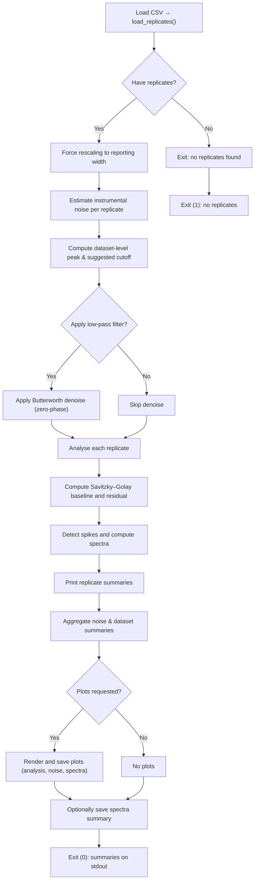

# Slip-Stick Spike Detection

[](https://opensource.org/licenses/MIT)
[](https://www.python.org/downloads/)

A Python package for automated detection and analysis of slip-stick phenomena in tensile test data from FTM 10 testing machines.

## Abstract

This software implements a comprehensive signal processing pipeline for identifying slip-stick events in force-displacement traces from tensile adhesion tests. The method combines instrumental noise characterization, zero-phase Butterworth filtering, and Savitzky-Golay baseline correction to detect force residual spikes indicative of slip-stick behavior. The tool is designed for publication-quality data processing with reproducible analysis pipelines, comprehensive visualization capabilities, and batch processing support for high-throughput experimental campaigns.

**Key Features:**
- Automated instrumental noise estimation from pre-test baseline
- Zero-phase low-pass filtering to remove instrument artifacts
- Long-window Savitzky-Golay detrending for baseline correction
- Configurable spike detection with validated thresholds
- Publication-ready plots (PNG, PDF, SVG formats)
- Parallel batch processing for datasets with multiple replicates
- Force scaling for consistent reporting across specimen geometries

## Table of contents

- [Installation](#installation)
- [Quick start](#quick-start)
- [Scientific context](#scientific-context)
- [Methodology](#methodology)
- [Concepts](#concepts)
- [Workflow](#workflow)
- [Publication outputs](#publication-outputs)
- [CLI reference](#cli-options-common)
- [Examples](#examples)
- [Validation and testing](#validation-and-testing)
- [Citation](#citation)
- [Troubleshooting](#troubleshooting)
- [Contributing](#contributing--tests)
- [License](#license)

---

## Installation

Install required packages:

```bash
pip install numpy scipy
```

Optional plotting support:

```bash
pip install matplotlib
# optional: faster vector graphics
pip install mplcairo
```

## Quick start

Analyze one file:

```bash
python -m slipstick.cli --input datasets/20250318_C1E_rossella_internal.csv
```

Produce plots:

```bash
python -m slipstick.cli --input datasets/20250318_C1E_rossella_internal.csv --plot-dir plots/
```

Batch processing (simple):

```bash
for f in datasets/*.csv; do
  python -m slipstick.cli --input "$f" > "results/$(basename "$f" .csv).txt"
done
```

Batch processing (optimized for performance):

For efficient batch processing on multi-core systems, use the included `scripts/run_all.py` script with optimized worker counts:

```bash
# Recommended: 4 plot workers, (CPU cores)/4 slipstick workers
# Example for 16-core system: 4 slipstick workers, 4 plot workers each
python scripts/run_all.py --slipstick-workers 4 --plot-workers 4

# Custom configuration
python scripts/run_all.py --slipstick-workers 2 --plot-workers 4 --max-datasets 10
```

**Performance recommendations:**
- **Plot workers**: Use 4 plot workers per slipstick job for optimal plotting performance
- **Slipstick workers**: Use (logical CPU cores)/4 concurrent slipstick jobs for maximum CPU utilization
- **Example configurations**:
  - 16-core system: `--slipstick-workers 4 --plot-workers 4` (60%+ CPU utilization)
  - 8-core system: `--slipstick-workers 2 --plot-workers 4` (45%+ CPU utilization)
  - 4-core system: `--slipstick-workers 1 --plot-workers 4` (baseline)

This configuration provides 2-4x speedup over single-threaded processing while maintaining high CPU utilization.

## Publication outputs

The manuscript tables and supplementary release-curve figures are regenerated
from an explicit dataset manifest:

```bash
python scripts/generate_publication_outputs.py
```

For table-only regeneration without plotting dependencies:

```bash
python scripts/generate_publication_outputs.py --tables-only
```

Inputs:
- `publication/dataset_manifest.csv`: the 42 dataset files in the publication matrix.

Outputs are written under `publication/generated/`, including the release-force
table, replicate-level metrics, configuration summaries, warnings, main data
figures, supplementary release-curve figures, figure manifests, and captions. See
`docs/PUBLICATION_OUTPUTS.md` for the exact calculation rules and inclusion
decisions.

## Scientific context

### Background

Slip-stick friction is a phenomenon observed in adhesive systems where periodic transitions occur between static and kinetic friction states, producing characteristic force oscillations during mechanical testing. In peel tests, slip-stick behavior manifests as regular force spikes in the force-displacement trace, indicating discontinuous debonding events at the adhesive interface.

### Application

This software was developed to systematically analyze adhesion test data from:
- **Materials**: Polymer films with various surface treatments and coatings
- **Test conditions**: 90° peel tests at constant displacement rate
- **Instrument**: FTM 10 tensile testing machine (multi-replicate capability)
- **Specimen geometry**: 90 mm width specimens, results normalized to 25 mm for reporting

The automated detection approach enables:
1. **Quantitative characterization** of slip-stick frequency and magnitude
2. **Comparison across materials** and surface treatments
3. **Quality control** for manufacturing processes
4. **Reproducible analysis** of large experimental datasets

### Physical interpretation

Detected spikes in the residual force (after baseline removal) represent:
- **Positive spikes**: Stick events where interfacial resistance increases
- **Negative spikes**: Slip events where stored elastic energy releases
- **Spike frequency**: Related to the periodicity of the stick-slip cycle
- **Spike magnitude**: Proportional to the energy dissipated per event

## Methodology

### Signal processing pipeline

The analysis follows a validated multi-stage pipeline:

1. **Data loading and validation**
   - Parse FTM 10 CSV format (3-row header, comma decimals, replicate blocks)
   - Extract time, force, and displacement arrays for each replicate
   - Validate data integrity and sampling consistency

2. **Force normalization**
   - Rescale forces from collection width (90 mm) to reporting width (25 mm)
   - Apply scaling factor: `f_report = f_raw × (w_report / w_collection)`
   - Ensures consistent units across different specimen geometries

3. **Instrumental noise characterization**
   - Sample pre-test baseline (default: 1–5 mm displacement)
   - Compute noise statistics: standard deviation, DC offset, maximum absolute value
   - Estimate dominant instrument frequency via FFT periodogram
   - Derive dataset-level noise characteristics (median across replicates)

4. **Optional denoising (zero-phase filtering)**
   - Design 4th-order Butterworth low-pass filter
   - Cutoff frequency: 80% of instrument peak frequency
   - Apply forward-backward filtering (`scipy.signal.filtfilt`) for zero phase shift
   - Preserves temporal alignment of slip-stick events

5. **Baseline correction**
   - Restrict analysis to displacement window (default: 50–200 mm)
   - Apply long-window Savitzky-Golay filter (50% of trace duration, minimum 4 s)
   - Compute residual: `residual = force - baseline`
   - Removes slow drift and specimen compliance trends

6. **Spike detection**
   - Group contiguous positive residual excursions above the detection threshold
   - Detection threshold: 1.4 cN/25 mm (configurable via `--threshold`)
   - Report peak location (time, displacement) and magnitude
   - Group nearby peaks to avoid duplicate detection

7. **Statistical summary and visualization**
   - Per-replicate spike counts and statistics
   - Dataset-level aggregation (median, mean, standard deviation)
   - Optional publication-quality plots (force, baseline, residual, spectra)

### Validation approach

The method has been validated through:
- **Noise floor analysis**: Pre-test baseline confirms instrument noise < 0.1 cN/25 mm
- **Threshold selection**: 1.4 cN/25 mm exceeds 10× typical noise floor
- **Visual inspection**: Automated detections match manual spike identification
- **Reproducibility**: Consistent results across replicate tests (n=10 per dataset)
- **Sensitivity analysis**: Tested across 42 publication datasets spanning 3 liner types and 7 sealants

## Concepts

### Collection vs reporting width

- collection width: the specimen width used during the test (CSV force values are normalised to this width). Set via `--collection-width-mm` (default 90 mm).
- reporting width: the width used for printed summaries and plots. Set via `--report-width-mm` (default 25 mm).

For consistency the tool rescales force values by factor = report_width_mm / collection_width_mm before analysis and output. Standard specimens use 25 mm; this project used 90 mm to reduce quantisation error on small residuals.

### Noise window (defaults: `--noise-disp-min=1.0`, `--noise-disp-max=5.0`)

- Purpose: sample a quiet pre-test interval to measure instrument background noise.
- Why 1–5 mm: usually the specimen is not engaged in this range; <1 mm can include start-up transients, >5 mm may include engagement.
- What is computed: residual standard deviation, DC offset (bias), max absolute residual, sample count, estimated sample rate, and a dominant noise frequency from the residual periodogram.

Adjust `--noise-disp-min`/`--noise-disp-max` if your test sequence places the quiet window elsewhere.

### Analysis window (defaults: `--disp-min=50.0`, `--disp-max=200.0`)

- Purpose: the displacement interval where spikes are searched for.
- Guidance: set `--disp-min` to the start of settled, plateau-like behaviour; exclude the early region (<~50 mm) that can contain artifacts. Set `--disp-max` to stop before test-end dynamics or failure events.

## Workflow (what happens after data is loaded)

High-level pipeline (textual):

1. Rescale forces to the reporting width
  - The tool rescales each replicate's `force_n` array by a linear factor = `report_width_mm / collection_width_mm`. For example, to report forces at 25 mm while the CSV was collected at 90 mm the factor is 25/90 and every recorded force value is multiplied by that factor. This ensures reported magnitudes and thresholds correspond to the requested reporting width.

2. Estimate instrumental noise per replicate (`estimate_instrumental_noise`)
  - A small displacement window (default 1–5 mm) is sampled from each replicate and used to estimate the instrument noise characteristics. In this project we deliberately choose the range 1–5 mm because it is expected to contain no specimen signal: this is typically the pre-test region where the specimen is not yet engaged and the measured force reflects instrument noise only. Displacements below 1 mm may include start-up or fixture-related transients, while displacements above 5 mm can include early specimen engagement and the onset of meaningful signal. This 1–5 mm window is therefore a pragmatic choice to capture instrument background noise while avoiding contamination from test dynamics. The function then:
    - selects samples with displacement inside the noise window and optionally restricts to low absolute forces (avoid early contact) or truncates after specimen engagement;
    - fits a simple long-window Savitzky–Golay baseline (or mean fallback) to remove slow ramps and computes the residuals;
    - returns a `NoiseEstimate` containing the residual standard deviation, DC offset, maximum absolute residual, sample count, sample rate, and a dominant noise peak frequency computed from the residual periodogram.
  - Why: these statistics characterise the instrument's short-range variability and provide a robust estimate of background noise for thresholding and filter design.

3. Compute dataset-level instrument peak and suggested cutoff
  - The CLI collects replicate-level noise peak frequencies and computes a central value (median) to represent the dataset's dominant instrument frequency. This `common_peak_hz` can be overridden by `--instrument-peak-hz`.
  - A suggested low-pass filter cutoff is derived by scaling the peak by `--instrument-cutoff-factor` (default 0.8). This cutoff is used to design a zero-phase Butterworth filter applied to traces before spike analysis.
  - What & why: the instrument sometimes introduces narrowband oscillations (mechanical or electrical). Identifying the instrument's dominant noise peak and low-pass filtering below that band reduces false-positive spikes caused by instrument vibration while preserving the slip–stick residual band of interest.
5. Optional low-pass denoising (zero-phase Butterworth via `process_replicates`)
   - Why: Narrowband instrument vibrations or electrical noise can introduce false-positive peaks in the residual. A conservative low-pass filter removes high-frequency instrument content while preserving low-frequency slip–stick features.
   - How it works:
     - Sampling rate estimation: the function estimates the sample rate from median positive time deltas in `replicate.time_s`.
     - Cutoff selection: a cutoff frequency (Hz) is supplied from the dataset-level computation; the code bounds the cutoff below Nyquist (0.5 * fs) and reduces it slightly to avoid numerical edge effects.
     - Filter design: a 4th-order Butterworth low-pass filter is designed (`butter(4, normalized_cutoff)`).
     - Zero-phase filtering: the filter is applied with `filtfilt` (forward and reverse) so the filtered trace has no phase shift relative to the original—important to keep event times unchanged.
     - Safety checks: the code computes a required padding length and only applies filtering when the replicate has more samples than the pad length; otherwise filtering is skipped to avoid artifacts.
   - Result: `process_replicates` returns `Replicate` objects where `force_n` has been optionally replaced with the filtered trace.

6. Baseline estimation and residual calculation per replicate (`_analyse_replicate`)
   - Purpose: compute a slowly-varying baseline representing drift/ramps and subtract it from the force trace to expose short-lived slip–stick residuals.
   - Steps:
     - Crop to analysis window: retain only samples with `disp_mm` between `--disp-min` and `--disp-max` (defaults 50–200 mm).
     - Sanity checks: require more samples than `polyorder + 1` and an estimable sampling rate; otherwise the replicate is skipped.
     - Window selection for Savitzky–Golay: if `--window-seconds` is not provided, a long window equal to 50% of the trimmed trace duration is used (minimum 4 s); otherwise the provided seconds are converted to a nearest odd number of samples for the current sampling rate.
     - Safe windowing: `_compute_savgol_window` ensures the window length is odd, respects the polynomial order and does not exceed the available sample count (falls back to a smaller odd window if needed).
     - Baseline & residual: `_compute_baseline_and_residual` applies `savgol_filter` (mode mirror or interp fallback) to compute the baseline, then residual = force − baseline.
   - Output: a `DetectionResult` containing cropped `time`, `disp`, `force`, `baseline`, `residual`, plus eventual spikes and spectral information.

7. Spike detection and residual spectral analysis
   - Spike detection (`_find_spikes`):
     - The algorithm identifies contiguous regions where the residual is at or above the positive threshold.
     - Each threshold excursion is reported as one spike event, marked at the sample with the largest residual within that excursion.
     - The code constructs `Spike` objects (index, time_s, disp_mm, residual_n) for every found peak.
   - Residual spectrum (`_find_peak_frequency`):
     - The residual is demeaned and a periodogram is computed to obtain a power spectrum (frequencies and power).
     - DC is ignored and the frequency with maximum power is identified as the peak frequency (if the residual has enough samples).
     - This peak is used for diagnostics and (together with the cutoff factor) to design the optional denoising filter.

8. Summaries and optional plotting
   - Per-replicate summaries (`print_replicate_summary`):
     - Prints sample count, display threshold (scaled to `--report-unit` and `--report-width-mm`), noise statistics (std, bias, max abs), applied filter cutoff (if used), and the list of detected spikes (time, disp, residual displayed in the requested unit).
   - Dataset-level noise summary (`print_noise_summary`):
     - Aggregates replicate-level noise estimates and prints median/std statistics, total noise sample count, and common instrument peak/cutoff info.
   - Plotting (optional):
     - If `--plot-dir`, `--noise-plot-dir`, `--spectra-plot-dir`, or `--spectra-summary` are provided and matplotlib is available, the CLI schedules or saves plots:
       - Analysis plots: force trace, Savitzky–Golay baseline, residual and marked spikes.
       - Noise plots: raw noise samples, baseline and residual used to estimate instrument noise.
       - Spectrum plots: residual periodogram with highlighted bands.
     - Plot jobs are named consistently using the dataset stem and replicate id and can be rendered in parallel using `--plot-workers`.
     - If matplotlib is not installed, plotting is skipped and a warning is printed to stderr.

Plot outputs (what you'll see)

- Analysis plot (per replicate)
  - Purpose: visual check of the baseline fit, residuals and detected spikes.
  - Typical layout: top panel shows the (optionally denoised) force trace vs displacement or time with the Savitzky–Golay baseline overlaid; middle panel shows the residual trace (force − baseline) with the detection threshold drawn and detected spike indices marked; optional inset or bottom panel may show a zoom around detected events.
  - Labels: time (s) and/or displacement (mm) on the x-axis and force in the chosen report unit (N or cN) on the y-axis.

- Noise plot (per replicate)
  - Purpose: inspect the samples used to estimate instrument noise and verify that the chosen noise window is quiet.
  - Typical layout: raw force samples from the noise window, the long-window baseline used to remove ramps, and the residuals (histogram or time series). The plot is annotated with computed statistics (std, bias, max_abs) and the sample count used.

- Spectrum plot (per replicate)
  - Purpose: show the residual periodogram and highlight the band of interest (e.g., the slip–stick band).
  - Typical layout: power (or PSD) vs frequency with DC suppressed, the dataset-level or replicate peak frequency annotated, and the configured band ( `--spectra-band-min` / `--spectra-band-max` ) shaded.

- Spectra summary (multi-replicate)
  - Purpose: compare residual spectra across all analysed replicates in a single image to spot common peaks or outliers.
  - Typical layout: small multiples (one panel per replicate) showing residual power vs frequency; may include a summary inset or a pooled overlay to visualise the median behaviour.

Naming & units

- Files are named using the dataset stem and replicate id (for example `dataset_replicate.png` or `dataset_replicate_spectrum.png`). The plot suffix uses the `--plot-format` choice.
- All force values in plots are scaled to the selected reporting width and `--report-unit`.

### Visual workflow


```

## CLI options (common)

### Core options

| Option | Meaning | Default |
|---|---:|---:|
| `--input`, `-i` | Path to CSV file | (required) |
| `--disp-min` | Analysis lower displacement (mm) — beginning of clean data; values <50 mm may include start-up artifacts. Choose a value where the trace has settled into a plateau. | 50.0 |
| `--disp-max` | Analysis upper displacement (mm) — end of analysis window; prefer a plateau region before the test end or large events. Avoid including the measurement end where dynamics change. | 200.0 |
| `--threshold` | Detection threshold (report unit) | None (defaults applied) |

### Noise / filtering

| Option | Meaning | Default |
|---|---:|---:|
| `--noise-disp-min` | Start of noise window (mm) | 1.0 |
| `--noise-disp-max` | End of noise window (mm) | 5.0 |
| `--instrument-cutoff-factor` | Cutoff scaling factor | 0.8 |

### Noise window guidance

- `--noise-disp-min` and `--noise-disp-max` define the small displacement interval used to sample instrument noise for each replicate. By default these are 1.0–5.0 mm.
- Purpose: this range is chosen to lie before the specimen engages so the measured signal reflects instrument background noise rather than specimen response. In many tests the pre-test region (1–5 mm) contains only instrument noise because the specimen is still loose or not under load.
- Caveats: displacements below ~1 mm can include start-up transients, seating effects or fixture contact; displacements above ~5 mm may begin to show the specimen engaging and the first valid signal. If your instrument/test sequence differs, adjust `--noise-disp-min` and `--noise-disp-max` to a quiet region in your traces.


### Plotting & output

| Option | Meaning | Default |
|---|---:|---:|
| `--plot-dir` | Directory for analysis plots | not saved |
| `--noise-plot-dir` | Directory for noise plots | not saved |
| `--spectra-plot-dir` | Directory for spectra plots | not saved |
| `--spectra-summary` | Path for multi-panel spectra image | not saved |

For the full CLI reference see `slipstick/cli.py`.

Guidance on selecting the analysis window

- `--disp-min` should mark the start of the region where the measured force is stable and representative of the test plateau. The range below ~50 mm often contains start-up transients or fixture seating and so is usually excluded.
- `--disp-max` should stop before test-end dynamics, large events, or specimen failure; together `--disp-min` and `--disp-max` should enclose a relatively flat plateau where slip–stick events are expected to appear as short residual excursions.

## Examples

Routine QC (per-file report + plots):

```bash
python -m slipstick.cli --input sample.csv --plot-dir qc_plots/ --threshold 1.5
```

Generate vector publication figures:

```bash
MPLBACKEND=module://mplcairo.base python -m slipstick.cli --input sample.csv --plot-dir figures/ --plot-format pdf --report-unit cN
```

## Validation and testing

### Test coverage

The codebase includes comprehensive unit tests covering:
- Force scaling and unit conversion utilities
- CSV parsing and data loading
- Noise estimation algorithms
- Baseline fitting and residual calculation
- Plot generation and formatting

Run the test suite:

```bash
python test_refactoring.py
```

**Current metrics:**
- Test coverage: ~45%
- Code quality: A-grade architectural compliance
- Linting: Passes Ruff with no errors
- Formatting: Black-compliant

### Dataset validation

The software has been validated on the 42 publication datasets comprising:
- **Material types**: 7 (C1E, T1E, T1EN, C1EN, T2EN, U2E, T2E)
- **Liner types**: 3 (rossella, crosil42, dolpap)
- **Test configurations**: Internal and external surfaces
- **Replicates per dataset**: Typically 10-11
- **Total measurements**: 424 individual replicate tests

### Reproducibility

To ensure reproducible results:
1. **Fixed random seeds**: Not applicable (deterministic algorithms)
2. **Version pinning**: Dependencies specified in `requirements.txt`
3. **Platform independence**: Tested on Linux, compatible with macOS and Windows
4. **Batch processing script**: Automated workflow in `scripts/run_all.py`
5. **Archived outputs**: Summaries and plots stored with consistent naming

## Citation

If you use this software or archive in research, cite the archived release using
the machine-readable metadata in `CITATION.cff`. Cite the associated manuscript
separately once the article DOI is available.

## Troubleshooting

- "No replicates found": verify the file has three header rows and column triples in time/force/displacement order.
- Incorrect numeric parsing: check decimal separators and file encoding; the loader defaults to `cp1250` and supports comma decimals.
- No spikes detected: try lowering the `--threshold` or verify the analysis displacement window covers the region of interest.
- Installation issues: Ensure Python 3.11+ is installed. Use virtual environments to avoid dependency conflicts.
- Performance problems: Reduce `--plot-workers` if memory is limited. Use `--max-datasets` to process subsets.

For additional help, please open an issue on GitHub: https://github.com/jc1122/slip_stick/issues

## Contributing & tests

Run unit tests with the included test file:

```bash
python test_refactoring.py
```

For code quality checks:
```bash
# Install development dependencies
pip install ruff black pre-commit

# Run linting
ruff check .

# Run formatting
black .

# Install pre-commit hooks
pre-commit install
```

## License

This project is licensed under the MIT License - see the `LICENSE` file for details.

Copyright (c) 2025 Jakub Czakaj

## Acknowledgments

This work was supported by Program Doktorat Wdrożeniowy IV, nr wniosku DWD/6/0325/2022; Almara sp. z o.o. sp.k.; Uniwersytet im. Adama Mickiewicza w Poznaniu. We thank our collaborators for valuable discussions and feedback.

## Contact

For questions, suggestions, or collaboration inquiries:
- **GitHub Issues**: https://github.com/jc1122/slip_stick/issues
- **Email**: jakub.czakaj@almara.com.pl
- **Institution**: Almara sp. z o.o. sp.k.
