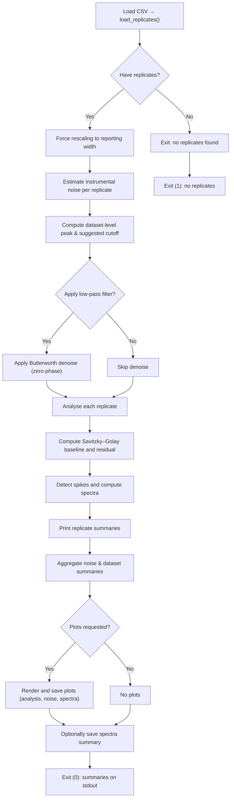

# Slip-stick Spike Detection

A compact command-line tool for finding slip–stick spikes in FTM 10 tensile-test CSVs.

It loads wide-format CSVs, characterises instrument noise, optionally denoises traces, subtracts a long Savitzky–Golay baseline to get residuals, detects spikes and prints concise summaries. Plots are optional.

## Table of contents

- [Quick start](#quick-start)
- [Concepts](#concepts)
- [Workflow](#workflow)
- [CLI reference (common)](#cli-reference-common)
- [Examples](#examples)
- [Troubleshooting](#troubleshooting)
- [Contributing & tests](#contributing--tests)

---

## Installation

Install required packages:

```bash
pip install numpy scipy
```

Optional plotting support:

```bash
pip install matplotlib
# optional: faster vector graphics
pip install mplcairo
```

## Quick start

Analyze one file:

```bash
python -m slipstick.cli --input datasets/20250317_C1E_rossella_internal.csv
```

Produce plots:

```bash
python -m slipstick.cli --input datasets/20250317_C1E_rossella_internal.csv --plot-dir plots/
```

Batch processing (simple):

```bash
for f in datasets/*.csv; do
  python -m slipstick.cli --input "$f" > "results/$(basename "$f" .csv).txt"
done
```

Batch processing (optimized for performance):

For efficient batch processing on multi-core systems, use the included `scripts/run_all.py` script with optimized worker counts:

```bash
# Recommended: 4 plot workers, (CPU cores)/4 slipstick workers
# Example for 16-core system: 4 slipstick workers, 4 plot workers each
python scripts/run_all.py --slipstick-workers 4 --plot-workers 4

# Custom configuration
python scripts/run_all.py --slipstick-workers 2 --plot-workers 4 --max-datasets 10
```

**Performance recommendations:**
- **Plot workers**: Use 4 plot workers per slipstick job for optimal plotting performance
- **Slipstick workers**: Use (logical CPU cores)/4 concurrent slipstick jobs for maximum CPU utilization
- **Example configurations**:
  - 16-core system: `--slipstick-workers 4 --plot-workers 4` (60%+ CPU utilization)
  - 8-core system: `--slipstick-workers 2 --plot-workers 4` (45%+ CPU utilization)
  - 4-core system: `--slipstick-workers 1 --plot-workers 4` (baseline)

This configuration provides 2-4x speedup over single-threaded processing while maintaining high CPU utilization.

## Concepts

### Collection vs reporting width

- collection width: the specimen width used during the test (CSV force values are normalised to this width). Set via `--collection-width-mm` (default 90 mm).
- reporting width: the width used for printed summaries and plots. Set via `--report-width-mm` (default 25 mm).

For consistency the tool rescales force values by factor = report_width_mm / collection_width_mm before analysis and output. Standard specimens use 25 mm; this project used 90 mm to reduce quantisation error on small residuals.

### Noise window (defaults: `--noise-disp-min=1.0`, `--noise-disp-max=5.0`)

- Purpose: sample a quiet pre-test interval to measure instrument background noise.
- Why 1–5 mm: usually the specimen is not engaged in this range; <1 mm can include start-up transients, >5 mm may include engagement.
- What is computed: residual standard deviation, DC offset (bias), max absolute residual, sample count, estimated sample rate, and a dominant noise frequency from the residual periodogram.

Adjust `--noise-disp-min`/`--noise-disp-max` if your test sequence places the quiet window elsewhere.

### Analysis window (defaults: `--disp-min=50.0`, `--disp-max=200.0`)

- Purpose: the displacement interval where spikes are searched for.
- Guidance: set `--disp-min` to the start of settled, plateau-like behaviour; exclude the early region (<~50 mm) that can contain artifacts. Set `--disp-max` to stop before test-end dynamics or failure events.

## Workflow (what happens after data is loaded)

High-level pipeline (textual):

1. Rescale forces to the reporting width
  - The tool rescales each replicate's `force_n` array by a linear factor = `report_width_mm / collection_width_mm`. For example, to report forces at 25 mm while the CSV was collected at 90 mm the factor is 25/90 and every recorded force value is multiplied by that factor. This ensures reported magnitudes and thresholds correspond to the requested reporting width.

2. Estimate instrumental noise per replicate (`estimate_instrumental_noise`)
  - A small displacement window (default 1–5 mm) is sampled from each replicate and used to estimate the instrument noise characteristics. In this project we deliberately choose the range 1–5 mm because it is expected to contain no specimen signal: this is typically the pre-test region where the specimen is not yet engaged and the measured force reflects instrument noise only. Displacements below 1 mm may include start-up or fixture-related transients, while displacements above 5 mm can include early specimen engagement and the onset of meaningful signal. This 1–5 mm window is therefore a pragmatic choice to capture instrument background noise while avoiding contamination from test dynamics. The function then:
    - selects samples with displacement inside the noise window and optionally restricts to low absolute forces (avoid early contact) or truncates after specimen engagement;
    - fits a simple long-window Savitzky–Golay baseline (or mean fallback) to remove slow ramps and computes the residuals;
    - returns a `NoiseEstimate` containing the residual standard deviation, DC offset, maximum absolute residual, sample count, sample rate, and a dominant noise peak frequency computed from the residual periodogram.
  - Why: these statistics characterise the instrument's short-range variability and provide a robust estimate of background noise for thresholding and filter design.

3. Compute dataset-level instrument peak and suggested cutoff
  - The CLI collects replicate-level noise peak frequencies and computes a central value (median) to represent the dataset's dominant instrument frequency. This `common_peak_hz` can be overridden by `--instrument-peak-hz`.
  - A suggested low-pass filter cutoff is derived by scaling the peak by `--instrument-cutoff-factor` (default 0.8). This cutoff is used to design a zero-phase Butterworth filter applied to traces before spike analysis.
  - What & why: the instrument sometimes introduces narrowband oscillations (mechanical or electrical). Identifying the instrument's dominant noise peak and low-pass filtering below that band reduces false-positive spikes caused by instrument vibration while preserving the slip–stick residual band of interest.
5. Optional low-pass denoising (zero-phase Butterworth via `process_replicates`)
   - Why: Narrowband instrument vibrations or electrical noise can introduce false-positive peaks in the residual. A conservative low-pass filter removes high-frequency instrument content while preserving low-frequency slip–stick features.
   - How it works:
     - Sampling rate estimation: the function estimates the sample rate from median positive time deltas in `replicate.time_s`.
     - Cutoff selection: a cutoff frequency (Hz) is supplied from the dataset-level computation; the code bounds the cutoff below Nyquist (0.5 * fs) and reduces it slightly to avoid numerical edge effects.
     - Filter design: a 4th-order Butterworth low-pass filter is designed (`butter(4, normalized_cutoff)`).
     - Zero-phase filtering: the filter is applied with `filtfilt` (forward and reverse) so the filtered trace has no phase shift relative to the original—important to keep event times unchanged.
     - Safety checks: the code computes a required padding length and only applies filtering when the replicate has more samples than the pad length; otherwise filtering is skipped to avoid artifacts.
   - Result: `process_replicates` returns `Replicate` objects where `force_n` has been optionally replaced with the filtered trace.

6. Baseline estimation and residual calculation per replicate (`_analyse_replicate`)
   - Purpose: compute a slowly-varying baseline representing drift/ramps and subtract it from the force trace to expose short-lived slip–stick residuals.
   - Steps:
     - Crop to analysis window: retain only samples with `disp_mm` between `--disp-min` and `--disp-max` (defaults 50–200 mm).
     - Sanity checks: require more samples than `polyorder + 1` and an estimable sampling rate; otherwise the replicate is skipped.
     - Window selection for Savitzky–Golay: if `--window-seconds` is not provided, a long window equal to 50% of the trimmed trace duration is used (minimum 4 s); otherwise the provided seconds are converted to a nearest odd number of samples for the current sampling rate.
     - Safe windowing: `_compute_savgol_window` ensures the window length is odd, respects the polynomial order and does not exceed the available sample count (falls back to a smaller odd window if needed).
     - Baseline & residual: `_compute_baseline_and_residual` applies `savgol_filter` (mode mirror or interp fallback) to compute the baseline, then residual = force − baseline.
   - Output: a `DetectionResult` containing cropped `time`, `disp`, `force`, `baseline`, `residual`, plus eventual spikes and spectral information.

7. Spike detection and residual spectral analysis
   - Spike detection (`_find_spikes`):
     - The algorithm uses SciPy's `find_peaks` on the absolute residual (abs(residual)) with `height=threshold`.
     - Each detected peak corresponds to a local maximum in the absolute residual that exceeds the threshold; contiguous multi-sample excursions are reported as a single peak if they contain a single local maximum.
     - The code constructs `Spike` objects (index, time_s, disp_mm, residual_n) for every found peak.
   - Residual spectrum (`_find_peak_frequency`):
     - The residual is demeaned and a periodogram is computed to obtain a power spectrum (frequencies and power).
     - DC is ignored and the frequency with maximum power is identified as the peak frequency (if the residual has enough samples).
     - This peak is used for diagnostics and (together with the cutoff factor) to design the optional denoising filter.

8. Summaries and optional plotting
   - Per-replicate summaries (`print_replicate_summary`):
     - Prints sample count, display threshold (scaled to `--report-unit` and `--report-width-mm`), noise statistics (std, bias, max abs), applied filter cutoff (if used), and the list of detected spikes (time, disp, residual displayed in the requested unit).
   - Dataset-level noise summary (`print_noise_summary`):
     - Aggregates replicate-level noise estimates and prints median/std statistics, total noise sample count, and common instrument peak/cutoff info.
   - Plotting (optional):
     - If `--plot-dir`, `--noise-plot-dir`, `--spectra-plot-dir`, or `--spectra-summary` are provided and matplotlib is available, the CLI schedules or saves plots:
       - Analysis plots: force trace, Savitzky–Golay baseline, residual and marked spikes.
       - Noise plots: raw noise samples, baseline and residual used to estimate instrument noise.
       - Spectrum plots: residual periodogram with highlighted bands.
     - Plot jobs are named consistently using the dataset stem and replicate id and can be rendered in parallel using `--plot-workers`.
     - If matplotlib is not installed, plotting is skipped and a warning is printed to stderr.

Plot outputs (what you'll see)

- Analysis plot (per replicate)
  - Purpose: visual check of the baseline fit, residuals and detected spikes.
  - Typical layout: top panel shows the (optionally denoised) force trace vs displacement or time with the Savitzky–Golay baseline overlaid; middle panel shows the residual trace (force − baseline) with the detection threshold drawn and detected spike indices marked; optional inset or bottom panel may show a zoom around detected events.
  - Labels: time (s) and/or displacement (mm) on the x-axis and force in the chosen report unit (N or cN) on the y-axis.

- Noise plot (per replicate)
  - Purpose: inspect the samples used to estimate instrument noise and verify that the chosen noise window is quiet.
  - Typical layout: raw force samples from the noise window, the long-window baseline used to remove ramps, and the residuals (histogram or time series). The plot is annotated with computed statistics (std, bias, max_abs) and the sample count used.

- Spectrum plot (per replicate)
  - Purpose: show the residual periodogram and highlight the band of interest (e.g., the slip–stick band).
  - Typical layout: power (or PSD) vs frequency with DC suppressed, the dataset-level or replicate peak frequency annotated, and the configured band ( `--spectra-band-min` / `--spectra-band-max` ) shaded.

- Spectra summary (multi-replicate)
  - Purpose: compare residual spectra across all analysed replicates in a single image to spot common peaks or outliers.
  - Typical layout: small multiples (one panel per replicate) showing residual power vs frequency; may include a summary inset or a pooled overlay to visualise the median behaviour.

Naming & units

- Files are named using the dataset stem and replicate id (for example `dataset_replicate.png` or `dataset_replicate_spectrum.png`). The plot suffix uses the `--plot-format` choice.
- All force values in plots are scaled to the selected reporting width and `--report-unit`.

### Visual workflow


```

## CLI options (common)

Core options:

| Option | Meaning | Default |
|---|---:|---:|
| `--input`, `-i` | Path to CSV file | (required) |
| `--disp-min` | Analysis lower displacement (mm) — beginning of clean data; values <50 mm may include start-up artifacts. Choose a value where the trace has settled into a plateau. | 50.0 |
| `--disp-max` | Analysis upper displacement (mm) — end of analysis window; prefer a plateau region before the test end or large events. Avoid including the measurement end where dynamics change. | 200.0 |
| `--threshold` | Detection threshold (report unit) | None (defaults applied) |

Noise / filtering:

| Option | Meaning | Default |
|---|---:|---:|
| `--noise-disp-min` | Start of noise window (mm) | 1.0 |
| `--noise-disp-max` | End of noise window (mm) | 5.0 |
| `--instrument-cutoff-factor` | Cutoff scaling factor | 0.8 |

Noise window guidance

- `--noise-disp-min` and `--noise-disp-max` define the small displacement interval used to sample instrument noise for each replicate. By default these are 1.0–5.0 mm.
- Purpose: this range is chosen to lie before the specimen engages so the measured signal reflects instrument background noise rather than specimen response. In many tests the pre-test region (1–5 mm) contains only instrument noise because the specimen is still loose or not under load.
- Caveats: displacements below ~1 mm can include start-up transients, seating effects or fixture contact; displacements above ~5 mm may begin to show the specimen engaging and the first valid signal. If your instrument/test sequence differs, adjust `--noise-disp-min` and `--noise-disp-max` to a quiet region in your traces.


Plotting & output:

| Option | Meaning | Default |
|---|---:|---:|
| `--plot-dir` | Directory for analysis plots | not saved |
| `--noise-plot-dir` | Directory for noise plots | not saved |
| `--spectra-plot-dir` | Directory for spectra plots | not saved |
| `--spectra-summary` | Path for multi-panel spectra image | not saved |

For the full CLI reference see `slipstick/cli.py`.

Guidance on selecting the analysis window

- `--disp-min` should mark the start of the region where the measured force is stable and representative of the test plateau. The range below ~50 mm often contains start-up transients or fixture seating and so is usually excluded.
- `--disp-max` should stop before test-end dynamics, large events, or specimen failure; together `--disp-min` and `--disp-max` should enclose a relatively flat plateau where slip–stick events are expected to appear as short residual excursions.

## Examples

Routine QC (per-file report + plots):

```bash
python -m slipstick.cli --input sample.csv --plot-dir qc_plots/ --threshold 1.5
```

Generate vector publication figures:

```bash
MPLBACKEND=module://mplcairo.base python -m slipstick.cli --input sample.csv --plot-dir figures/ --plot-format pdf --report-unit cN
```

## Troubleshooting

- "No replicates found": verify the file has three header rows and column triples in time/force/displacement order.
- Incorrect numeric parsing: check decimal separators and file encoding; the loader defaults to `cp1250` and supports comma decimals.
- No spikes detected: try lowering the `--threshold` or verify the analysis displacement window covers the region of interest.

## Contributing & tests

Run unit tests with the included test file:

```bash
python test_refactoring.py
```

## License

MIT-style (see repository for details).

